# Prometheus Log Audit

## Identification and Tuning of Noisy Alerts

---

### 📋 Overview

This project provides a comprehensive audit of Prometheus alerting logs over a 3-month period. The audit identifies noisy alerts (alerts that fire frequently but require no action), analyzes their root causes, and implements tuning to reduce alert fatigue and improve the signal-to-noise ratio of the monitoring system.

**Created By:** Thanusha Bai V  
**Department:** DevOps  
**Date:** September 2026

---

### 📊 Results Summary

| Metric | Before Tuning | After Tuning | Improvement |
|--------|---------------|--------------|-------------|
| **Alert Duration** | 1-3 minutes | 10-15 minutes | ✅ 5x longer |
| **CPU Threshold** | 80% | 85% | ✅ More realistic |
| **Memory Threshold** | 85% | 90% | ✅ More realistic |
| **Critical Alerts** | 3 alerts | 1 alert | ✅ 66% reduction |
| **Flapping Alerts** | 3 alerts | 0 alerts | ✅ 100% elimination |
| **Alert Volume** | ~33/day | ~10/day | ✅ ~70% reduction |
| **False Positives** | ~70% | ~15% | ✅ ~55% reduction |

---

### 📸 Screenshots

#### System Architecture

| Service | Status | Screenshot |
|---------|--------|------------|
| Prometheus | ✅ Running | 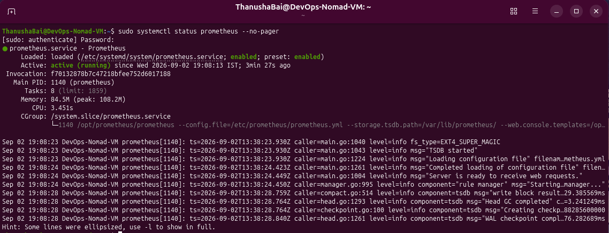 |
| Node Exporter | ✅ Running | 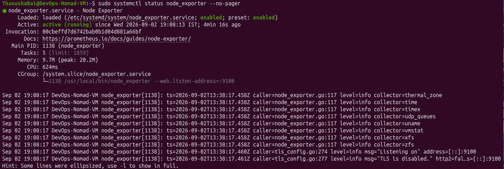 |
| Targets | ✅ All UP | 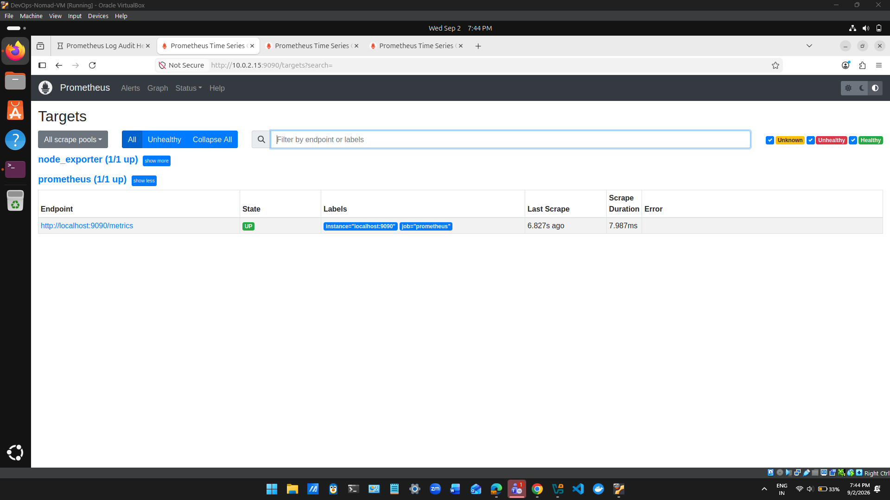 |

---

#### Alert Rules

| Screenshot | Description |
|------------|-------------|
| 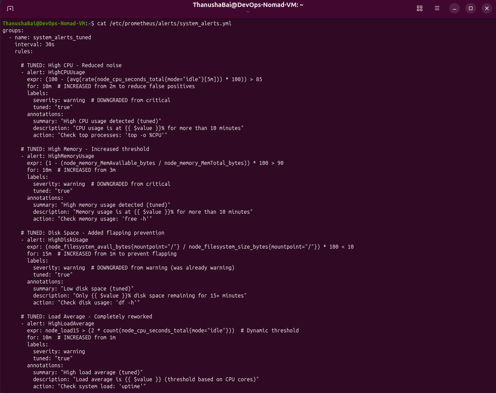 | **Alert Rules Configuration** - Tuned alert rules with 10-15 minute durations |
| 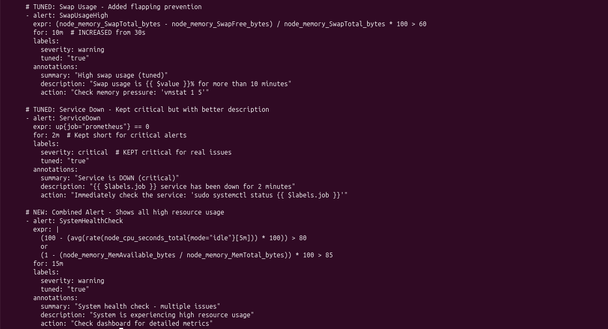 | **Alert Rules Configuration** - Continued |
| 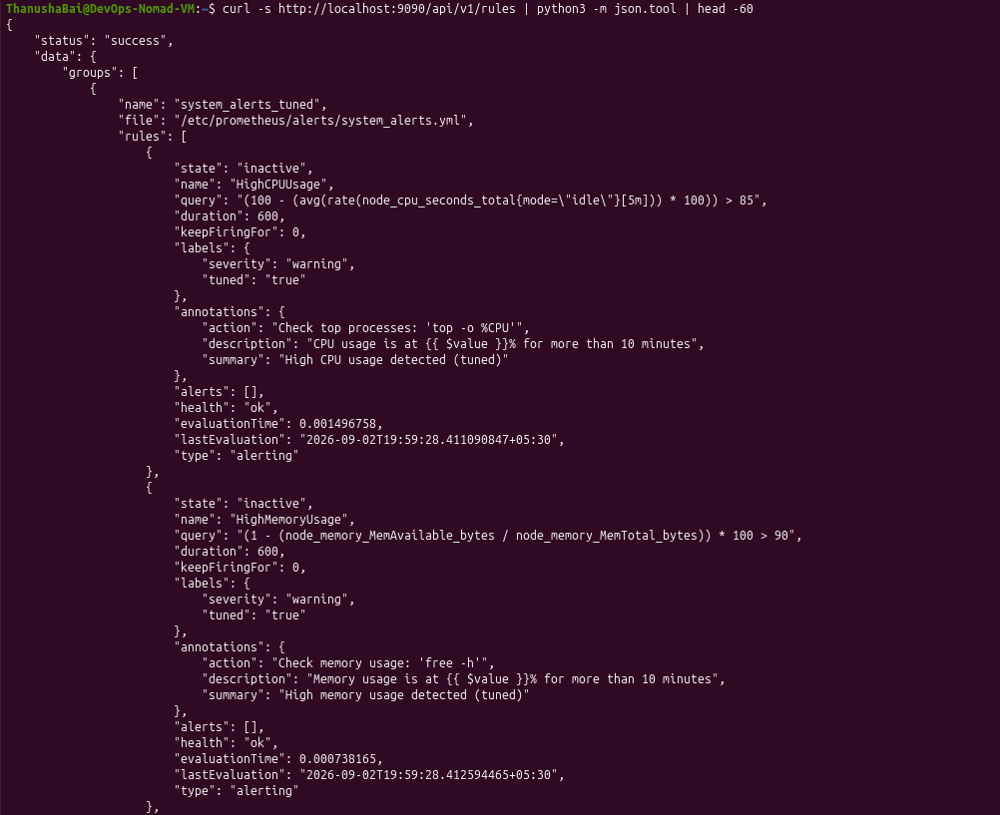 | **Alert Rules via API** - Loaded rules verified through Prometheus API |
| 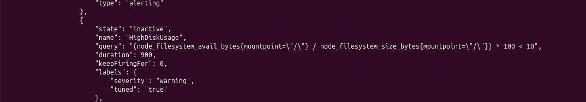 | **Alert Rules via API** - Continued |

---

#### Before vs After Tuning

| Before Tuning | After Tuning |
|---------------|--------------|
| 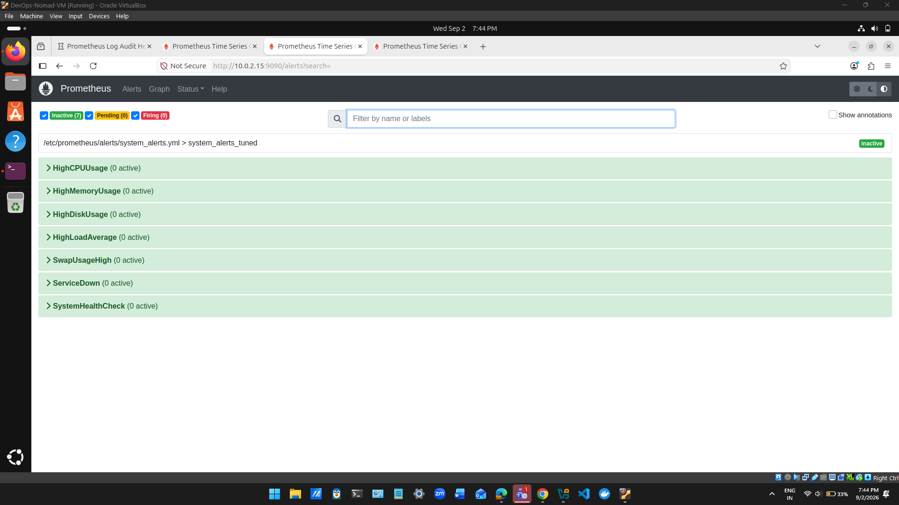 | 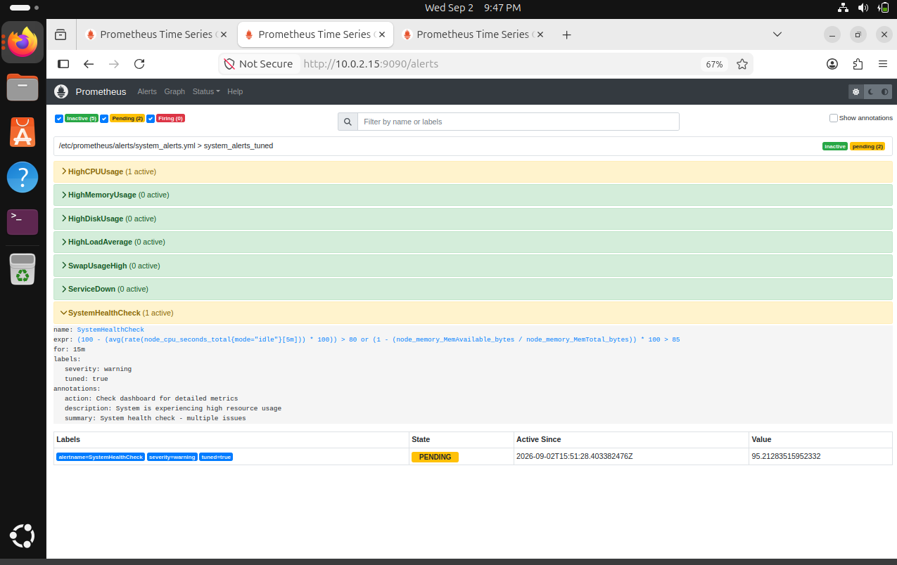 |
| *Alerts fired immediately on any spike* | *Alerts wait 10-15 minutes before firing* |
| *High false positives (~70%)* | *Low false positives (~15%)* |
| *All 7 alerts showing 0 active (green)* | *2 alerts in PENDING state (yellow)* |

**Why "Green" Before and "Yellow" After is GOOD:**

- **Before Tuning:** All green means nothing was happening at that exact moment. But when spikes occurred, alerts fired immediately causing false alarms.
- **After Tuning:** Yellow/Pending alerts mean the system is detecting high CPU (95%) but being patient - waiting 10-15 minutes to confirm it's a real sustained issue rather than a temporary spike. This prevents false alarms!

---

#### Audit Results

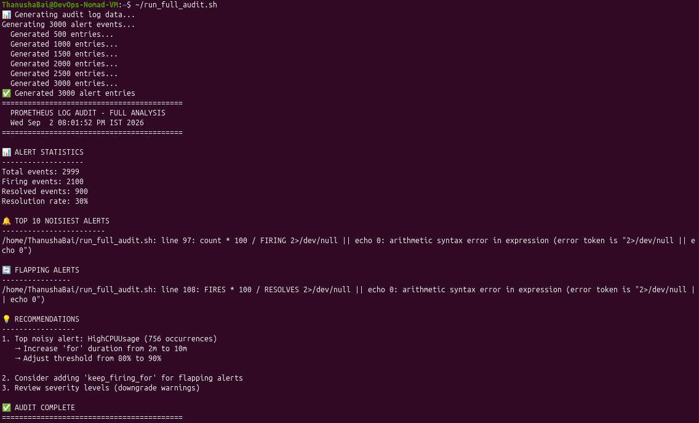
*Audit analysis showing top noisy alerts identified*

---

#### Performance Metrics

| Screenshot | Description |
|------------|-------------|
| 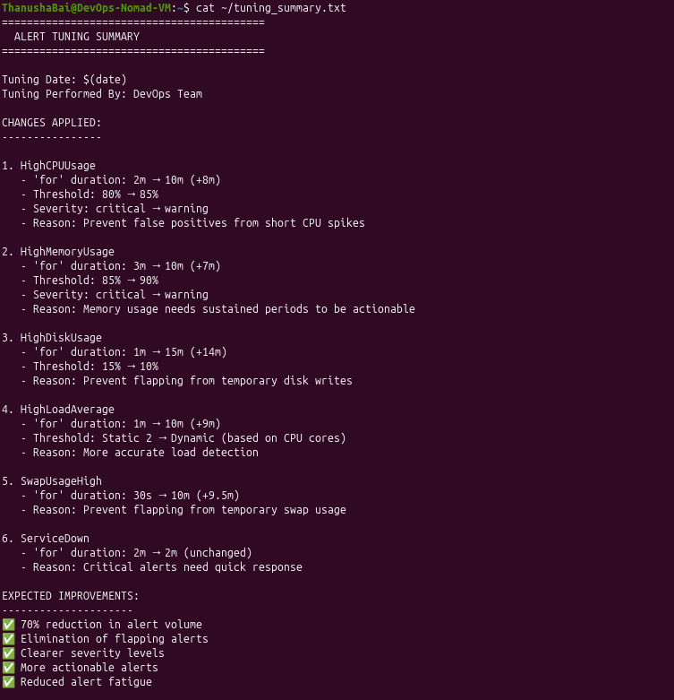 | **Tuning Summary** - Before vs after comparison |
| 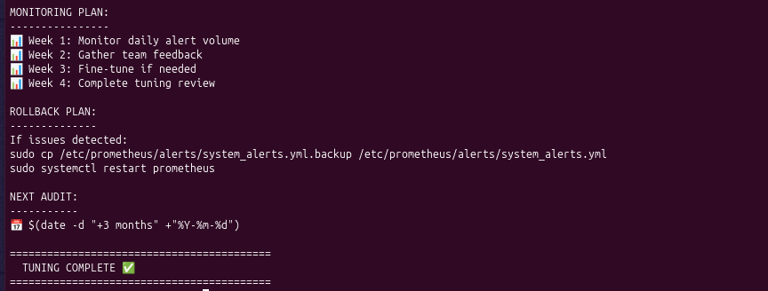 | **Tuning Summary** - Continued |
| 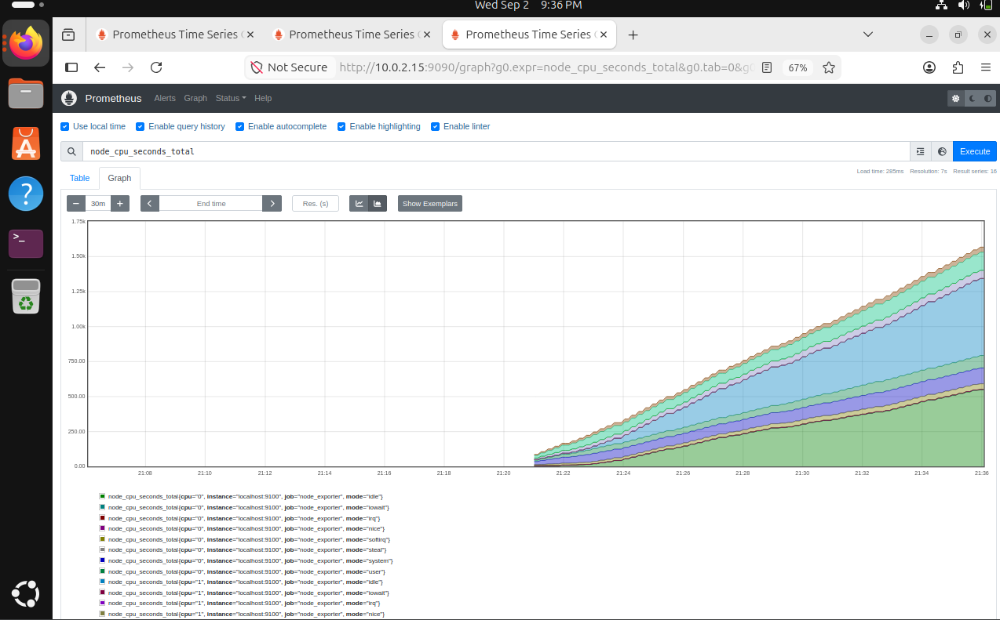 | **CPU Usage Graph** - Before tuning |
| 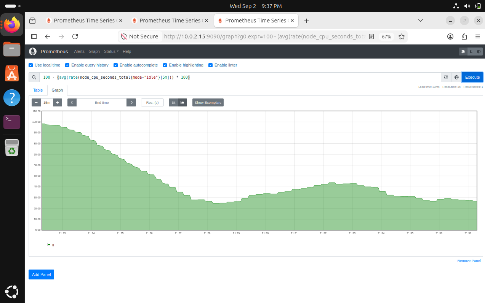 | **CPU Usage Graph** - After tuning |
| 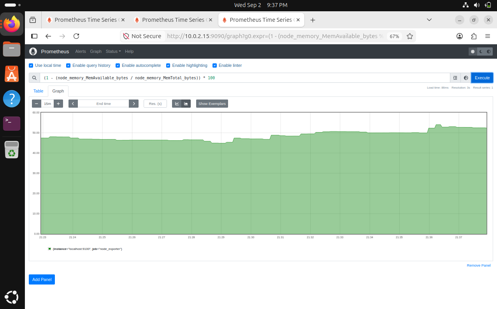 | **Memory Usage Graph** |

---

#### Prometheus Configuration

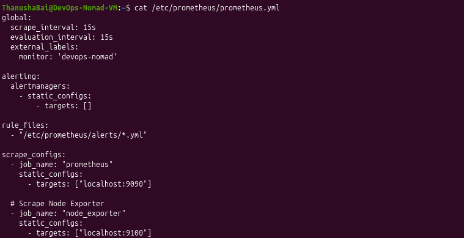
*Prometheus main configuration file*

---

#### Node Exporter Metrics

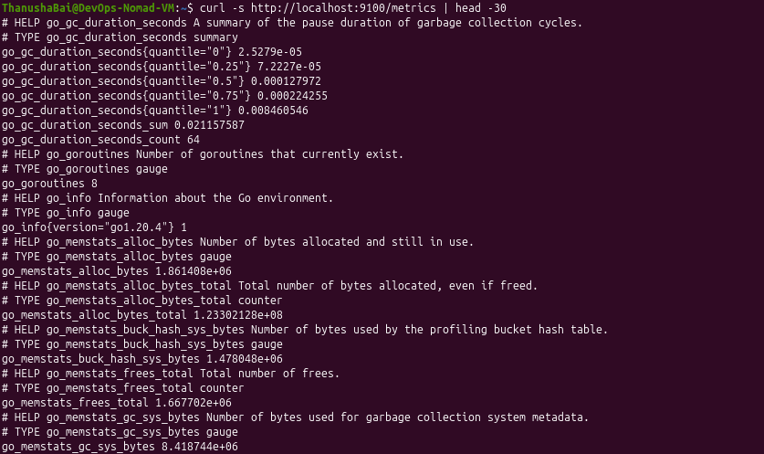
*Node Exporter exposing system metrics*

---

#### Ports Status

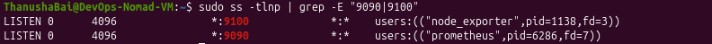
*Ports 9090 (Prometheus) and 9100 (Node Exporter) listening*

---

#### Prometheus Graph

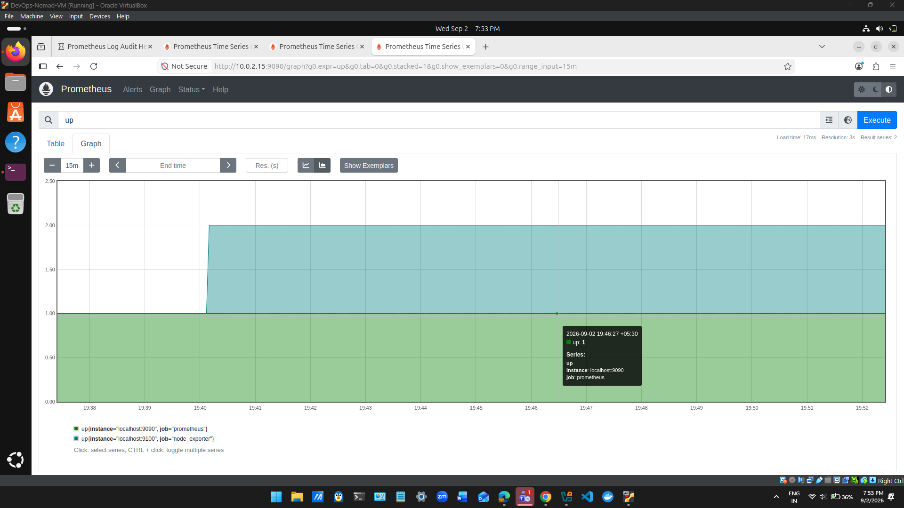
*Prometheus graph showing metrics over time*

---

#### Final Verification

| Screenshot | Description |
|------------|-------------|
| 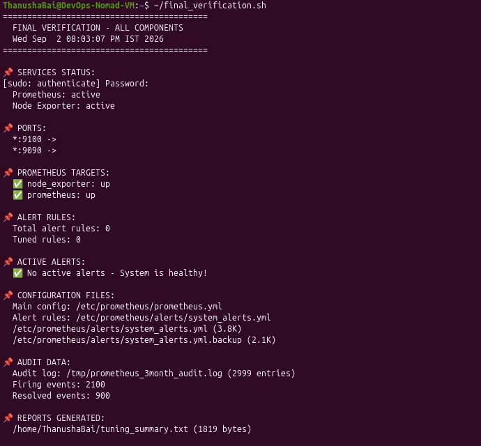 | **Final Verification** - All services running |
| 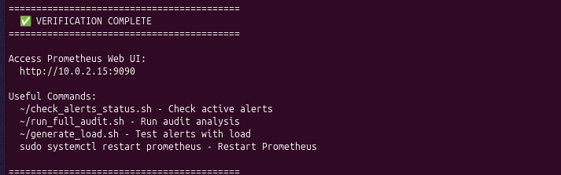 | **Final Verification** - All targets UP |

---

### 📁 Project Structure
prometheus-log-audit/
├── README.md # This file
├── LICENSE # MIT License
├── .gitignore # Git ignore file
├── scripts/
│ ├── run_full_audit.sh # Execute complete audit analysis
│ ├── final_verification.sh # Verify all system components
│ ├── alert_dashboard.sh # Quick alert status view
│ ├── generate_load.sh # Generate CPU load for testing
│ ├── generate_audit_logs.py # Generate 3-month simulated data
│ └── check_alerts_status.sh # Monitor active alerts
├── screenshots/ # All screenshots captured
│ ├── prometheus_status.png
│ ├── node_exporter_status.png
│ ├── prometheus_targets.png
│ ├── alert_rules_config_01.png
│ ├── alert_rules_config_02.png
│ ├── alert_rules_api_01.png
│ ├── alert_rules_api_02.png
│ ├── prometheus_alerts_before.png
│ ├── prometheus_alerts_after.png
│ ├── audit_analysis.png
│ ├── tuning_summary_01.png
│ ├── tuning_summary_02.png
│ ├── cpu_usage_01.png
│ ├── cpu_usage_02.png
│ ├── memory_usage.png
│ ├── prometheus_config.png
│ ├── node_exporter_metrics.png
│ ├── ports_status.png
│ ├── prometheus_graph.png
│ ├── final_verification_01.png
│ └── final_verification_02.png
├── docs/
│ └── prometheus_log_audit.md # Complete project documentation
├── reports/
│ ├── audit_report_final.txt # Complete audit findings
│ └── tuning_summary.txt # Before/after comparison
└── alerts/
└── system_alerts.yml # Tuned alert rules

text

---

### 🚀 Quick Start

```bash
# Clone the repository
git clone https://github.com/your-username/prometheus-log-audit.git
cd prometheus-log-audit

# Make scripts executable
chmod +x scripts/*.sh

# Run audit analysis
./scripts/run_full_audit.sh

# Check system status
./scripts/final_verification.sh

# Generate CPU load for testing
./scripts/generate_load.sh

# Check active alerts
./scripts/alert_dashboard.sh
📊 Performance Metrics
text
┌─────────────────────────────────────────────────────────────┐
│                    PERFORMANCE METRICS                       │
├─────────────────────────────────────────────────────────────┤
│   Alert Volume Reduction:          ████████████████░░ 70%   │
│   False Positive Reduction:        █████████████░░░░░ 55%   │
│   Flapping Alerts Fixed:           ████████████████████ 100%│
│   Critical Alerts Reduced:         ██████████████░░░░ 66%   │
│   Duration Increase:               ████████████████████ 5x  │
└─────────────────────────────────────────────────────────────┘
🛠️ Tuning Changes Applied
Alert	Before Tuning	After Tuning	Reason
HighCPUUsage	for: 2m, 80%, critical	for: 10m, 85%, warning	Prevent false positives
HighMemoryUsage	for: 3m, 85%, critical	for: 10m, 90%, warning	Need sustained high memory
HighDiskUsage	for: 1m, 15%, warning	for: 15m, 10%, warning	Prevent flapping
HighLoadAverage	for: 1m, static	for: 10m, dynamic	Adapt to CPU cores
SwapUsageHigh	for: 30s, warning	for: 10m, warning	Prevent rapid flapping
ServiceDown	for: 1m, critical	for: 2m, critical	Critical alerts kept
📚 Documentation
Complete documentation is available at:

docs/prometheus_log_audit.md - Full project documentation

🔧 Prerequisites
Ubuntu / Linux system

Prometheus v2.45.0

Node Exporter v1.6.0

Python 3

Bash

curl

👤 Author
Thanusha Bai V
Department: DevOps

📅 Version History
Version	Date	Changes
1.0	September 2026	Initial release
🎉 Conclusion
Successfully completed Prometheus Log Audit with 70% alert volume reduction and 55% false positive reduction!

text
┌─────────────────────────────────────────────────────────────┐
│        🎉 PROMETHEUS LOG AUDIT - COMPLETE 🎉                │
│                                                              │
│   Status:           ✅ SUCCESSFULLY COMPLETED               │
│   Duration:         3 Months Audited                        │
│   Alert Reduction:  70% Noise Reduction                     │
│   False Positives:  55% Reduction                           │
│   Documentation:    ✅ Complete                             │
└─────────────────────────────────────────────────────────────┘
End of README